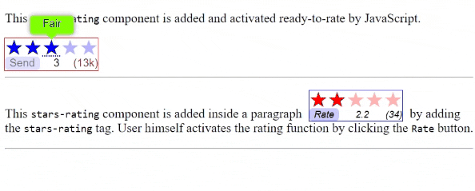

# stars-rating component
This is a 5-stars rating component. A standard custom web component written in pure vanilla JS. So it could be used in any framework.

## Usage:
This component could be used to show current average rating value and the count of ratings. Developers could make the component ready to rating or could wait for users to click a button to start rating process. Users then choose the rating they want and click a button to send that rate. The component then raises an event to inform developers that a rating is sent. After that the component is no more active, meaning that users could not rate any more.

Use the component like any other tag:
1. In html: `<stars-rating id="rater_1" rating="2.6" count="1520"></stars-rating>`
2. In JS: `document.createElement("stars-rating")` or `new StarsRating()`

- To change the words in tooltip for stars alter this static array of the component class:
  `StarsRating.ratingLabels = ["Terrible", "Poor", "Fair", "Good", "Great"];`

- To change the words of the button alter this static array of the component class: `StarsRating.ratingBtnLabels = ["Rate", "Send"];`

## Attributes:
- rating attribute: `<stars-rating rating="2.6" ></stars-rating>`
- count  attribute: `<stars-rating count="1520"></stars-rating>`

## Styling:
1. Define in an element's selector blok one or more of the following custom properties:

- `--rating-text-font`: component font
- `--rating-stars-font`: stars font
- `--rating-stars-color`: stars color
- `--rating-btn-color`: button color
- `--rating-btn-bg-color`: button background color
- `--rating-btn-shadow`: button box-shadow
- `--rating-tip-color`: tip background color
- `--rating-tip-width`: tip box width
- `--rating-tip-border`: tip border
- `--rating-tip-shadow`: tip box-shadow

Note: the "line-height" of the stars font control the spaces above & below them (0.8 is recommended)

or

2. You can reach the following parts of the component:

- `::part(stars)`: the stars themseves (styles will be applied on each star)
- `::part(rateBtn)`: the rate button
- `::part(rating)`: the rating number
- `::part(count)`: the counting number
- `::part(tip)`: the div that contains the whole tip
- `::part(tip-text)`: the p tag (paragraph) that contains the text of the tip

  ex: `#rater_1::part(count) { color: red; }` to make the count number red

## Events:
- `rating`: The component defines this event to return the evaluation in event's property `event.detail`.

  ex: `document.body.addEventListener("rating", e => { console.log(e.detail); });`
